<div align="center">
  
</div>

<div align="center">
  <a href="https://github.com/HankSWillians">
    
  </a>
</div>

<div align="center">
  <a href="https://www.linkedin.com/in/german-scioville-4128aa3b9/">
    
  </a>
  <a href="mailto:germansrivas@gmail.com">
    
  </a>
  <a href="mailto:gscioville@unbosque.edu.co">
    
  </a>
  <a href="https://codeforces.com/profile/Scioville">
    
  </a>
</div>

<br />

## 👨‍💻 About Me

I'm a **9th-semester Systems Engineering student** at **Universidad El Bosque** in Bogotá, Colombia, driven by one question: *how do we build software that is both intelligent and secure?*

My work sits where **cybersecurity**, **artificial intelligence** and **cloud engineering** meet. For my undergraduate thesis I'm building a platform where **reinforcement learning agents learn to tackle cybersecurity problems**, and along the way I designed a **domain-specific language (DSL)** to define RL environments.

On the engineering side, I enjoy designing clean, secure backends: event-driven, serverless systems on **AWS**, hexagonal architecture, automated testing and **DevSecOps** pipelines with security scanning baked in from the first commit.

For the last **4 years** I've been part of my university's **competitive programming team** (Advanced rank), which taught me to think algorithmically, stay calm under pressure and work as a team when the clock is ticking.

```python
class German:
    role       = "Systems Engineering Student (9th semester)"
    university = "Universidad El Bosque"
    location   = "Bogotá, Colombia 🇨🇴"
    focus      = ["Cybersecurity", "Artificial Intelligence", "Cloud & DevSecOps"]
    thesis     = "Reinforcement learning agents for cybersecurity"
    languages  = {"Spanish": "Native", "English": "Learning"}
    motto      = "Build it, break it, secure it."
```

## 🎯 Interests

| | Area | What draws me in |
|:-:|---|---|
| 🛡️ | **Cybersecurity** | Offensive and defensive security, threat detection, secure-by-design systems |
| 🤖 | **Artificial Intelligence** | Reinforcement learning, intelligent agents, AI applied to security |
| ☁️ | **Cloud & DevSecOps** | Serverless and event-driven architectures, CI/CD, security automation |
| 🌐 | **Networking** | Network protocols, IPv4/IPv6 addressing, infrastructure |
| 🧠 | **Algorithms** | Competitive programming, data structures, problem solving |
| 💻 | **Web Development** | Backend APIs and full-stack applications |

## 🛠️ Tech Stack

**Languages**

<p align="left">
  
</p>

**Cloud, DevOps & Tools**

<p align="left">
  
</p>

**Databases & Operating Systems**

<p align="left">
  
</p>

## 🚀 Featured Projects

### ☕ [CoffeeScale](https://github.com/HankSWillians/Coffeescale)
IoT inventory replenishment system: digital scales report the weight of each coffee sack and, when stock drops below a threshold, the system automatically generates a purchase order to the ERP.

- **Architecture:** 7 AWS Lambda functions, event-driven with SQS, hexagonal architecture at the domain core
- **Security:** HMAC-SHA256 signed telemetry, secrets in Parameter Store, least-privilege IAM, OIDC-based CI/CD
- **Quality:** unit and integration tests, SAST/SCA with Bandit, Semgrep and pip-audit, CloudWatch alarms


### 🛡️ RL Agents for Cybersecurity *(thesis, in progress)*
A platform that applies reinforcement learning agents to cybersecurity problems.

### 🧩 DSL for Reinforcement Learning Environments
A domain-specific language, designed and implemented from scratch in a Compilers course, for defining RL environments.

### 🔁 [CI/CD Lab](https://github.com/HankSWillians/ci-cd-lab)
Continuous integration pipeline with GitHub Actions and automated tests with Jest.

## 📊 GitHub Stats

<div align="center">
  
  
</div>

<div align="center">
  
</div>
